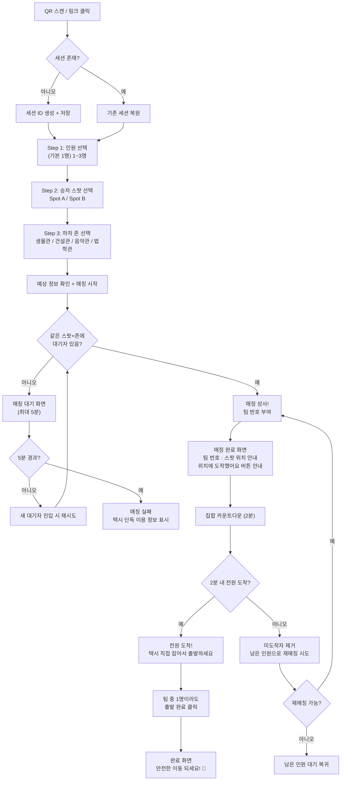

# 낑기타자 — 기능 명세서 v1

> **서비스 한 줄 정의**: 로그인 없이 QR/링크로 들어와, 인원·승차 스팟·하차 존을 선택하면, 같은 조건의 팀을 매칭하고 팀 번호를 부여하여 빠르게 출발시키는 부산대역 현장형 택시동승 모바일 웹(PWA)
>
> 작성일: 2026-03-22  
> 파일럿 기간: 2주  
> 서비스명: **낑기타자**

---

## 1. 제품 정보

| 항목 | 값 |
|------|-----|
| 서비스명 | 낑기타자 |
| 형태 | 모바일 웹 PWA (라이트 모드 기본) |
| 진입 방식 | 현장 QR 스캔 / 커뮤니티 링크 |
| 로그인 | 없음 (세션 기반) |
| 파일럿 규모 | 부산대역 앞 2개 스팟, 동시접속 100명 내외 |
| 파일럿 기간 | 2주 |

---

## 2. 승차 스팟 (Pickup Spots)

| ID | 이름 | 실제 위치 | 색상 |
|----|------|----------|------|
| `spot_a` | Spot A | 부산대역 3번 출구 전담 SPOT 맞은편 | 🔵 파랑 `#2563EB` |
| `spot_b` | Spot B | 부산대역 1번 출구 어벤더치 맞은편 | 🟢 초록 `#16A34A` |

- QR은 **스팟별이 아닌 통합 QR** (사용자가 화면에서 스팟 직접 선택)
- QR URL: `https://{domain}/join`
- 커뮤니티 링크 진입도 동일 URL
- 현장 QR 포스터: A4 코팅 방수

---

## 3. 하차 존 (Drop Zones)

| ID | 존 이름 | 구분 |
|----|---------|------|
| `m1` | 생물관 | 중부 |
| `m2` | 건설관 | 중부 |
| `u1` | 음악관 | 상부 |
| `u2` | 법학관 | 상부 |

- **같은 존 사용자끼리만 매칭** (다른 존 간 교차 매칭 없음)
- 하차 존은 버튼 선택 방식 (자유 입력 아님)

---

## 4. 유저 플로우

### 4-1. 전체 흐름도



### 4-2. 스텝별 상세

#### Step 1: 진입 (QR / 링크)
- QR 스캔 또는 커뮤니티 링크 클릭 → `https://{domain}/join` 접속
- QR은 **통합 QR** (스팟별이 아님)
- 세션 ID 생성 (LocalStorage), 새로고침해도 유지
- 닉네임 자동 생성 (수정 불가)

#### Step 2: 인원 선택
- **문구**: `"지금 몇 명인가요?"`
- **선택지**: `1명`(기본 선택), `2명`, `3명`
- 보통 1인이므로 **1명이 기본 선택** 상태

#### Step 3: 승차 스팟 선택
- **문구**: `"어디에서 택시 타실 건가요?"`
- **선택지**: 2개 스팟 버튼
  - 🔵 `Spot A` — 3번 출구 전담 SPOT 맞은편
  - 🟢 `Spot B` — 1번 출구 어벤더치 맞은편
- 위치 설명 텍스트 함께 표시

#### Step 4: 하차 존 선택
- **문구**: `"어디까지 가시나요?"`
- **선택지**: 4개 존 버튼
  - 중부: `생물관`, `건설관`
  - 상부: `음악관`, `법학관`

#### Step 5: 예상 정보 확인 → 매칭 시작
- 표시 항목:
  - 예상 총 택시비 (좁은 범위, 예: `7,000~8,000원`)
  - 예상 1인 부담 (현재 인원 기준)
  - 예상 이동 시간
  - 예상 도착 시각
- **[매칭 시작]** 버튼

#### Step 6: 매칭 대기
- 로딩 애니메이션
- 현재 대기 정보 (스팟, 존, 인원)
- 같은 방향 대기자 수 표시
- **[취소]** 버튼
- 최대 5분 대기

#### Step 7: 매칭 완료 → 팀 번호 부여
- **표시 정보**:
  - 🏷️ **팀 번호** (예: `#42`) — 크게 표시
  - 팀원 닉네임 목록 + 인원 수
  - 집합 스팟 이름 + 색상 + 위치 설명
  - 총 탑승 인원
  - 예상 1인 부담 (확정 인원 기준)
- **안내 문구**: `"스팟에 도착하면 [위치에 도착했어요] 버튼을 눌러주세요"`
- **집합 카운트다운**: 2분

#### Step 8: 도착 확인
- 각 팀원이 스팟에 도착하면 **[위치에 도착했어요]** 버튼 클릭
- 화면에 누가 도착했고 누가 아직인지 실시간 표시
  - 예: `✅ 푸른고양이 도착 / ⏳ 빛나는별 대기 중`
- **2분 내 전원 도착 시**: `"전원 도착! 택시를 잡아서 출발하세요 🚕"`
- **2분 내 미도착자 있을 시**: 미도착자 자동 제거 → 남은 인원으로 다른 대기자와 재매칭 시도

#### Step 9: 출발
- 전원 도착 확인 후 → `"택시를 직접 잡아서 출발하세요!"`
- 팀 중 **1명이라도 [출발 완료] 클릭** → 전체 팀 출발 완료 처리

#### Step 10: 완료
- `"출발 완료! 안전한 이동 되세요. 🚕"`
- 피드백 수집 없음

### 4-3. 매칭 실패 시
- 5분 내 매칭 불가 → `"현재 같은 방향 대기자가 없습니다"`
- 택시 단독 이용 정보 표시 (요금, 이동 시간)
- 처음으로 돌아가기 버튼

### 4-4. 미도착자 제거 후 재매칭
- 2분 내 [위치에 도착했어요]를 누르지 않은 팀원 → 팀에서 제거
- 제거된 사용자에게: `"집합 시간이 초과되었습니다"` + 노쇼 카운트 +1
- 남은 도착 팀원:
  - 대기 큐에서 같은 스팟+존의 다른 대기자와 **즉시 재매칭 시도**
  - 재매칭 성공 시 → 새 팀 번호 부여 → 2분 집합 재시작
  - 재매칭 불가 시 → 대기 상태로 복귀 (최대 5분까지 대기 가능)

---

## 5. 매칭 엔진

### 5-1. 매칭 조건

```
같은 승차 스팟 (spot_a or spot_b)
  AND 같은 하차 존 (m1, m2, u1, u2 중 하나)
  AND status = 'waiting'
```

### 5-2. 매칭 규칙

| 상황 | 동작 |
|------|------|
| **조건 일치하는 대기자 발견** | 즉시 매칭 → 팀 번호 부여 → 집합 안내 |
| **대기자 없음, 2분 경과** | 현재 인원으로 출발 추천 |
| **5분 경과** | 매칭 실패 → 단독 이용 정보 표시 |

### 5-3. 팀 번호 시스템

- 매칭 성사 시 **팀 번호** 자동 부여 (예: `#42`)
- 당일 1번부터 순차 증가 (자정에 리셋)
- 팀원은 이 번호로 서로를 찾음
- 화면에 크게 표시

### 5-4. 인원 조합 예시

| 대기 A | 대기 B | 합계 | 결과 |
|--------|--------|------|------|
| 1명 | 1명 | 2명 | 매칭 → 팀 번호 부여 |
| 1명 | 2명 | 3명 | 매칭 → 팀 번호 부여 |
| 2명 | 2명 | 4명 | 매칭 → 팀 번호 부여 (택시 풀) |
| 1명 | — | 1명 | 대기 → 2분 후 출발 추천 or 5분 만료 |
| 3명 | — | 3명 | 바로 출발 가능 (추가 대기 제안 가능) |
| 3명 | 1명 | 4명 | 매칭 → 팀 번호 부여 (택시 풀) |

### 5-5. 매칭 트리거

- 새 큐 엔트리 생성 시 즉시 매칭 시도
- 5초 주기 폴링으로 재시도
- 서버 사이드에서만 실행

### 5-6. 미도착 시 재매칭

- 2분 내 [위치에 도착했어요] 미클릭 팀원 → 팀에서 제거
- 남은 도착 팀원 → 대기 큐의 다른 사용자와 **즉시 재매칭 시도**
- 재매칭 성공 → 새 팀 번호 부여
- 재매칭 불가 → 대기 상태 복귀

---

## 6. 요금/시간 계산

### 6-1. 요금 테이블 (Spot → Zone)

> 사용자가 실제 택시 요금 검색 후 입력 예정. 아래는 구조 예시.

| Spot → Zone | 최소 요금 | 최대 요금 | 이동 시간 |
|-------------|----------|----------|----------|
| Spot A → 생물관(M1) | TBD | TBD | TBD |
| Spot A → 건설관(M2) | TBD | TBD | TBD |
| Spot A → 음악관(U1) | TBD | TBD | TBD |
| Spot A → 법학관(U2) | TBD | TBD | TBD |
| Spot B → 생물관(M1) | TBD | TBD | TBD |
| Spot B → 건설관(M2) | TBD | TBD | TBD |
| Spot B → 음악관(U1) | TBD | TBD | TBD |
| Spot B → 법학관(U2) | TBD | TBD | TBD |

- 시간대별 할증 없음
- 요금은 **좁은 범위** (예: `7,000~8,000원`)
- 100원 단위 올림
- "예상" 접두어 필수

### 6-2. 1인 부담 표시

| 현재 인원 | 표시 |
|----------|------|
| 1명 | `2인 기준 1인 약 X,X00원` |
| 2명 | `지금 출발 기준 1인 약 X,X00원` |
| 3명 | `지금 출발 기준 1인 약 X,X00원` |

### 6-3. 도착 시각

```
예상 도착 = 현재 시각 + 매칭 대기 + 집합(2분) + 택시 이동 + 하차 후 도보
```

---

## 7. 집합 UX

### 7-1. 집합 제한 시간: **2분**

### 7-2. 집합 흐름

```
매칭 완료 → 팀 번호 부여
  ↓ "스팟에 도착하면 버튼을 눌러주세요" 안내
  ↓ 카운트다운 2분 시작
  │
  ├─ 각 팀원 [위치에 도착했어요] 클릭
  │   ↓ 화면에 도착 현황 실시간 표시
  │
  ├─ 전원 도착 → "택시를 직접 잡아서 출발하세요!" 안내
  │   ↓
  │   팀 중 1명이라도 [출발 완료] 클릭 → 출발 확정 🚕
  │
  └─ 2분 경과 + 미도착자 있음
      ↓ 미도착자 제거 (노쇼 처리)
      ↓ 남은 도착 팀원 → 다른 대기자와 재매칭 시도
```

### 7-3. 도착 확인

- 각 팀원이 스팟에 도착하면 **[위치에 도착했어요]** 버튼 클릭
- 실시간 도착 현황 표시: `✅ 도착` / `⏳ 대기 중`
- 전원 도착 시 → `"전원 도착! 택시를 직접 잡아서 출발하세요 🚕"`

### 7-4. 출발 확인 방식

- 팀 중 **1명이라도 [출발 완료] 클릭** → 팀 전체 출발 완료 처리
- 택시는 사용자가 직접 잡음 (서비스는 매칭만 제공)

### 7-5. 미도착 시 처리

- 2분 내 [위치에 도착했어요] 미클릭 → 해당 팀원 제거
- 제거된 팀원 → 노쇼 카운트 +1, `"집합 시간 초과"` 안내
- 남은 도착 팀원 → 같은 스팟+존 대기자와 즉시 재매칭 시도

---

## 8. 신뢰/안전 장치

### 8-1. 닉네임
- **자동 생성만 허용** (수정 불가)
- 형식: `형용사 + 명사` (예: `푸른고양이`, `하얀별`)

### 8-2. 노쇼 페널티 (세션 기반)

| 횟수 | 페널티 |
|------|--------|
| 1회 | 경고 문구 표시 |
| 2회 | 5분 쿨타임 (큐 진입 불가) |
| 3회 | 30분 차단 |

### 8-3. 세션 중복 방지
- LocalStorage 기반 session_id
- 하나의 session_id로 동시에 1개 `waiting` 엔트리만 허용

### 8-4. 신고 버튼
- 유형: 노쇼, 허위 인원, 불쾌한 행동, 기타
- 운영자에게 전달

### 8-5. 법적 안내 문구
- 간단 1줄: `"낑기타자는 동승 정보 매칭만 제공하며, 택시 요금은 탑승자 간 직접 정산합니다."`

---

## 9. 운영자 대시보드

### 9-1. 접근
- **Supabase Auth 기반 이메일 로그인**
- 관리자 1인 운영

### 9-2. 기능

| 기능 | 설명 |
|------|------|
| 실시간 큐 현황 | 스팟별/존별 대기자 수 |
| 엔트리 삭제 | 장난/잘못된 입력 제거 |
| 매칭 강제 확정/해제 | 수동 매칭 제어 |
| 스팟 활성/비활성 | 토글 |
| 요금 테이블 수정 | 스팟→존별 요금 편집 |
| 신고 접수 목록 | 신고 내역 확인 |
| 세션 차단 | 악의적 세션 블랙리스트 |

### 9-3. 통계 (Full)
- 오늘 매칭 수 + 출발률
- 시간대별 수요
- 노쇼율
- 스팟별 현황
- 누적 트렌드 그래프
- CSV 다운로드
- 대시보드 차트

---

## 10. 기술 구조

### 10-1. 스택

| 항목 | 기술 |
|------|------|
| 프론트엔드 | Next.js 14 (App Router) |
| 스타일 | Vanilla CSS + CSS Variables |
| 백엔드/DB | Supabase (PostgreSQL) |
| 실시간 | Supabase Realtime |
| 인증(관리자) | Supabase Auth |
| 배포 | Vercel |
| 테마 | 라이트 모드 기본 |

### 10-2. 데이터베이스 스키마

#### `pickup_spots`

| 컬럼 | 타입 | 설명 |
|------|------|------|
| `id` | text PK | `spot_a`, `spot_b` |
| `name` | text | `Spot A` |
| `location_desc` | text | `부산대역 3번 출구 전담 SPOT 맞은편` |
| `color` | text | `#2563EB` |
| `active` | boolean | 활성 여부 |

#### `drop_zones`

| 컬럼 | 타입 | 설명 |
|------|------|------|
| `id` | text PK | `m1`, `m2`, `u1`, `u2` |
| `name` | text | `생물관`, `건설관`, `음악관`, `법학관` |
| `zone_group` | text | `mid` / `upper` |
| `walk_minutes` | integer | 하차 후 도보 시간 |

#### `fare_table`

| 컬럼 | 타입 | 설명 |
|------|------|------|
| `pickup_spot_id` | text FK | |
| `drop_zone_id` | text FK | |
| `fare_min` | integer | 최소 요금 (원) |
| `fare_max` | integer | 최대 요금 (원) |
| `ride_minutes` | integer | 이동 시간 (분) |

#### `queue_entries`

| 컬럼 | 타입 | 설명 |
|------|------|------|
| `id` | uuid PK | |
| `session_id` | text | |
| `nickname` | text | 자동 생성 |
| `party_size` | integer | 1~3 |
| `pickup_spot_id` | text FK | 사용자 직접 선택 |
| `drop_zone_id` | text FK | |
| `status` | text | `waiting`/`matched`/`arrived`/`expired`/`cancelled`/`departed`/`noshow` |
| `match_id` | uuid FK nullable | |
| `noshow_count` | integer | 세션 내 노쇼 횟수 |
| `created_at` | timestamptz | |

#### `matches`

| 컬럼 | 타입 | 설명 |
|------|------|------|
| `id` | uuid PK | |
| `team_number` | integer | 당일 순차 팀 번호 (예: 42) |
| `pickup_spot_id` | text FK | |
| `drop_zone_id` | text FK | |
| `total_party_size` | integer | |
| `eta_minutes` | integer | |
| `est_fare_min` | integer | |
| `est_fare_max` | integer | |
| `assembly_deadline` | timestamptz | 집합 마감 (2분) |
| `status` | text | `assembling`/`all_arrived`/`departed`/`cancelled` |
| `created_at` | timestamptz | |

#### `reports`

| 컬럼 | 타입 | 설명 |
|------|------|------|
| `id` | uuid PK | |
| `reporter_session_id` | text | |
| `match_id` | uuid FK | |
| `type` | text | `noshow`/`wrong_count`/`bad_behavior`/`other` |
| `description` | text nullable | |
| `created_at` | timestamptz | |

#### `blocked_sessions`

| 컬럼 | 타입 | 설명 |
|------|------|------|
| `session_id` | text PK | |
| `reason` | text | |
| `blocked_until` | timestamptz | |
| `created_at` | timestamptz | |

---

## 11. 페이지 구조

| 라우트 | 용도 |
|--------|------|
| `/join` | QR/링크 진입 → 인원/스팟/존 선택 → 매칭 시작 |
| `/waiting/{entry_id}` | 매칭 대기 화면 |
| `/team/{match_id}` | 매칭 완료 → 팀 번호 → 도착 확인 → 출발 |
| `/result` | 완료/실패 화면 |
| `/admin` | 관리자 대시보드 (Supabase Auth 로그인) |

---

## 12. 운영 계획

| 항목 | 내용 |
|------|------|
| 파일럿 기간 | 2주 |
| QR 배포 | A4 크기, 코팅 방수 처리, 현장 부착 |
| 링크 배포 | 커뮤니티(에브리타임 등)에 링크 공유 |
| 관리자 | 1인 (기획자 본인) |
| 피드백 | 수집 안 함 (MVP) |
| 서비스명 | 낑기타자 |
| 테마 | 라이트 모드 기본 |
| 로고 | AI 생성 |

---

## 13. 디자인 가이드

### 13-1. 색상 (라이트 모드)

```css
:root {
  --bg-primary: #FFFFFF;
  --bg-card: #F8FAFC;
  --bg-surface: #F1F5F9;
  --text-primary: #0F172A;
  --text-secondary: #475569;
  --text-muted: #94A3B8;
  
  --color-primary: #2563EB;
  --color-primary-light: #60A5FA;
  --color-success: #16A34A;
  --color-warning: #EAB308;
  --color-danger: #DC2626;
  
  --spot-a: #2563EB;  /* 파랑 */
  --spot-b: #16A34A;  /* 초록 */
}
```

### 13-2. 타이포그래피
- `Noto Sans KR` (한국어 최적)
- 기본 `16px`, 제목 `20~24px`

### 13-3. 모바일 퍼스트
- 최대 너비 `480px`
- 터치 타겟 최소 `48px`
- 큰 버튼, 큰 글자 (야외 가독성)

---

## 14. MVP에서 제외하는 것

- ❌ 로그인/회원가입
- ❌ 채팅
- ❌ 실시간 지도
- ❌ AI 추천
- ❌ 자동 결제
- ❌ 기사 호출
- ❌ 4인 팀 처리
- ❌ 시간대 할증
- ❌ 존 간 교차 매칭
- ❌ 피드백 수집
- ❌ 다크 모드

---

## 15. 성공 지표

| 지표 | 목표 |
|------|------|
| QR → 대기 진입 | 15초 이내 |
| 매칭 후 집합 시작 | 2분 이내 |
| 매칭 후 실제 출발률 | 70% 이상 |
| 일일 매칭 성사 | 1건 이상 (파일럿 초기) |
